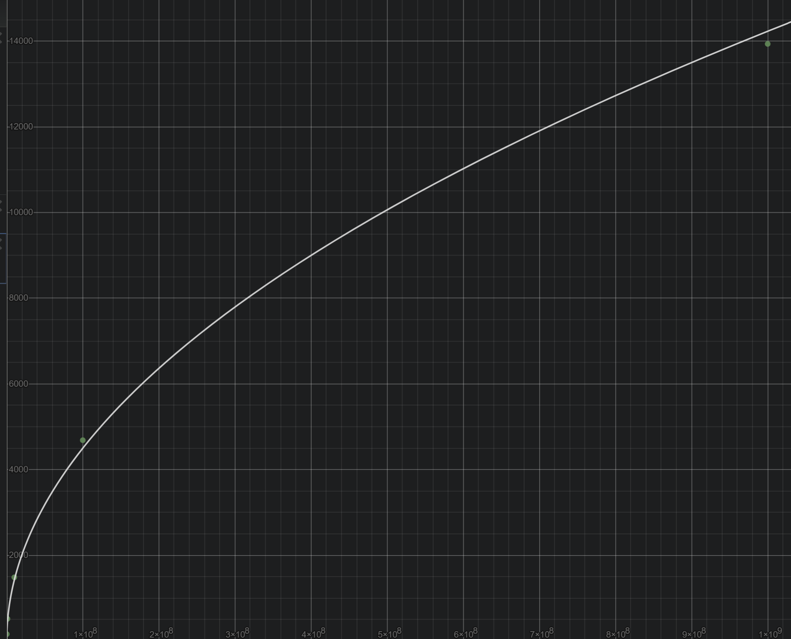
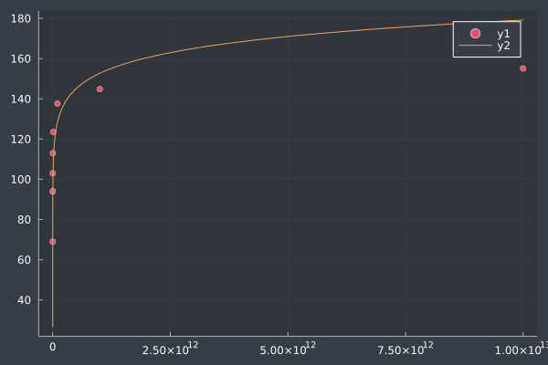

# Primality Testing

This is a project where I am exploring various algorithms for testing whether or not a number is prime. What are the different running times of these algorithms? How can we speed this process up? 

## The Dumb Solution

What is the obvious way of testing if a number is prime? Well, we just test all the numbers less than the number we intend to test, if any of them divide the number, it isn't prime. This algorithm would look something like: 
```julia
function is_prime_stupid(n::Int)
    if n < 2 # ignore inputs less than 2 (1 isn't prime)
        return false
    elseif n == 2 # 2 is prime
        return true
    end # if 

    for i in 2:n-1 # check all odd numbers between 2 and n-1
        if n % i == 0 # if n is divisable by i then it isn't prime
            return false
        end # if
    end # for

    return true # if we get to this point then n is prime
end # function is_prime_stupid
```

The only thing other than testing all the numbers below the inputted number we are doing is: 1) checking if the number is negative or 1 (either way, we are just going to say it isn't prime (we don't care about negative numbers)) and 2) if the number is 2, because we want to algorithm to be correct and 2 is prime. 

After this one bit of actually doing some logic, we just loop through every single number less than n, test to see n is divisable by it, if it is, then n isn't prime. Once we loop through all of that, if we didn't find a number n was divisable by, then it must be prime. 

What is the running time of this? Well considering worst case (so any number besides 1 and 2) this runs in O(n) time. You loop through every number less than n and then do an operation at each step. There is a chance this terminates on the first loop (at 2 for example if it is even), but for a prime number, this will loop through EVERY value. 

We can confirm that this does indeed run in O(n) time: 
```
random number range → maximum time (ns), average time (ns)
10000, 100000 → 173831.8 ns, 8342 ns
100000, 1000000 → 1.6671904e6 ns, 104439 ns
1000000, 10000000 → 1.13468907e7, 1.4186300875e6 ns 
10000000, 100000000 → 1.541426022e8, 3.08285237e7 ns 
```

Maximum time is a little bit of a better measurement here as this algorithm (despite being really stupid) still runs quite fast on even numbers (it is one check at the beginning of the loop and then if it is even it just terminates there). Still, this is very clearly O(n) time. 

But the fact that it is O(n) time isn't necessarily the bad part. If you think about it, really any algorithm testing for primes will be in O(n) time as the larger the number, the more things you have to check. Just... We can reduce the amount of checks necessary quite substantially. 

## Slightly Less Dumb (But Still Dumb) Solution

We can speed up our algorithm in a few ways without having to make any cool math jumps (which is what happens for some later algorithms). We can do this by thinking about factoring a number. This algorithm is searching for a way to split one number into 2 different numbers (which when multiplied together gets you back to that inital number). When you multiply two positive integers together, we can say:
```
a ⋅ b ≥ b  and  a ⋅ b ≥ a
```

Basically, multiplying by a natural number will always yeild a greater number (unless it is 1, in which case it will be the same). Why does this matter? Well what is the smallest number we are going to be checking? 2. And if the number we are checking for if it is prime is divisable by 2, then we know ```2 ⋅ x/2 = x``` As we are only considering integers, we won't have a multiplier less than 2... And increasing ```x/2``` by anything would, by definition, increase the result of ``` 2 ⋅ x/2```. Therefore, we don't have to check any numbers greater than ```n/2```. An example of this working could be with 64: 
```
1 ⋅ 64
2 ⋅ 32 
4 ⋅ 16
8 ⋅ 8 
```
The smallest number we need to check is 2, and the number that it muliplies with will be the largest. Therefore, we don't need to check any numbers larger than the number divided by 2, there just aren't any integers that could multiply to get back to the number. 

So we can write this algorithm like so:
```julia
function is_prime_less_stupid(n::Int)
    if n < 2 # ignore inputs less than 2 (1 isn't prime)
        return false
    elseif n == 2 # 2 is prime
        return true
    elseif n % 2 == 0 # if n is divisable by 2 (and isn't 2) then it isn't prime 
        return false 
    end # if 

    for i in 2:Int(ceil(n/2)) # check all odd numbers between 2 and n-1
        if n % i == 0 # if n is divisable by i then it isn't prime
            return false
        end # if
    end # for

    return true # if we get to this point then n is prime
end # function is_prime_less_stupid
```

Here we are only really making a few changes. For one, we are checking to see if the number is even immedietly and not in the first loop. This won't have major performance impacts, but it should at least make it such that the code never has to generate the iter object saving a bit of memory. But the main change is we are looking for numbers, below half of the number we are testing, to see if they divide our number. 


Testing this algorithm, we get the results: 
```
random number range → maximum time (ns), average time (ns)
10000, 100000 → 70517.8 ns, 3210 ns
100000, 1000000 → 659495.5 ns, 38442.2 ns
1000000, 10000000 → 5.2918406e6, 403156.5 ns 
10000000, 100000000 → 1.72449799e7, 663289.7 ns 
```

And yeah, that is faster. In fact, as we would expect, it is roughly 2x the speed of our previous algorithm. Though these gains are entirely expected from a naive approach as all we have really done in optimization is removed calculations that we had already done. Now we look at some more interesting algorithms. 

## That Algorithm I Found on Wikipedia

A while back when looking at implementing RSA, I needed a way to find primes (very large primes), and so I didn't want to spend hours just trying to find a massive prime. Hence, I looked at [wikipedia](https://en.wikipedia.org/wiki/Primality_test). I came across quite an odd algorithm which I just looked at the code for, I got confused, and moved on with RSA. But this was partially the inspiration for this project, and the reason for that is that I was so confused by this test that I wanted to explore it a bit more. 

So what kinds of optimizations does the Wikipedia page talk about? Well for starters, it builds on removing uneccessary tests. Now I talked about not testing and numbers greater than n/2, but we can actually stop testing all numbers greater than √n. Why? Well let's look at our 64 example from before: 
```
1 ⋅ 64
2 ⋅ 32 
4 ⋅ 16
8 ⋅ 8 
```

The largest number that isn't paired with a larger number is 8 (if that made any sense). For 1, 2, and 4, we could test those numbers or larger numbers. At 8, we see a turn around where the two factors are as close as possible (here they are equal). As you may notice, 8 is √64. We find this because, intuitively, the point where a number multiplied by itself is another is just the square root. If we increase one of the factors, that has to come with a decrease of the other (and vise versa). Therefore, decreasing from 8 will test all factors above 8, and the other way around. As there are less numbers below √n than above it, we might as well just test numbers up until √n. 

But we can actually imporve this even more when we notice that all primes greater than 3 follow the pattern of 6k ± 1 (I would believe it I am just not entirely sure how you get here. Insert some math stuff.). For all other numbers, we can represent them as 6k + 0, 6k + 2, 6k + 3, 6k + 4. But we will notice that the following are divisable by 2: 6k + 0, 6k + 2, 6k + 4, and the following is divisable by 3: 6k + 3. Therefore, if we immeditely check to see if the number is divisable by 2 or 3, we can remove a significant chunk of numbers without checking any further. 

From here, we just check every single number that is of the form 6k ± 1 ≤ √n in order to find any divisability of n. This is about 3x as fast as checking every number below √n as we are checking 2 in every 6 numbers, or 1 in 3. Essentially, we are testing all numbers that have the possibility of being prime (by the 6k ± 1 rule, though this obviously produces some non-primes) below √n. We can do this as every non-prime can be disassembled into primes, meaning we test those primes, we don't need to test the number itself. This yeilds us the algorithm: 

```julia
function is_prime(n::Int)
    if n <= 3 # if n is 2 or 3, it is prime (so if it is <= 3 and greater than 1), otherwise 1 isn't and we don't test negative numbers
        return n > 1
    end # if 

    if (n % 2 == 0) || (n % 3 == 0) # if n is divisable by 2 or 3, then it isn't prime
        return false
    end # if

    i=5 # start iteration at 5 
    while i^2 <= n # only need to check until √n 
        if (n % i == 0) || (n % (i+2) == 0) # if n is divisable by i or i+2, then it isn't prime (6k - 1 or 6k + 1 because we started at 5)
            return false
        end # if
        i += 6 # increment by 6 
    end # while

    return true # if we get to this point then n is prime    
end # function is_prime
```

The Wikipedia page also talks about optimizations in the form of storing a fair amount of primes and testing all of them off the bat, which would speed things up considerably but which I won't do here. Testing the algorithm, we find it performs like so: 
```
random number range → maximum time (ns), average time (ns)
10000, 100000 → 159.6 ns, 14.8 ns
100000, 1000000 → 516.8 ns, 34.6 ns
1000000, 10000000 → 1485.9 ns, 81.19 ns 
10000000, 100000000 → 4685.9 ns, 226.49 ns 
100000000, 1000000000 → 13934.9 ns, 614.7 ns
```

That is so much faster than the previous algorithms. This makes sense, of course, as instead of running in O(n/2) time we are running in O(√n/3) time... Which is much faster. So fast I even waited in 2 seconds for numbers on the magnitude of 1000000000, which took longer than a minute and I gave up on for previous algorithms. We can see that this does actually run in O(√n) time by doing a quick, messy graph in Desmos: 



It is what Wikipedia says! What a surprise. 

So, overall, this is a massive improvement over the incredibly naive initial implementation. But we can do better, we get into some even faster algorithms to compute primes (even if they might not always be entirely accurate). 

## The Fermat Test

By Fermat's Theorem (I used sources [here](https://crypto.stanford.edu/pbc/notes/numbertheory/millerrabin.html) and [here](https://en.wikipedia.org/wiki/Fermat_primality_test#:~:text=If%20one%20wants%20to%20test,a%20if%20p%20is%20composite.) for this section), we must have the following be true for all primes (for n being the prime and for any a): 
``` 
a^(n-1) = 1 (mod n)
```
(Excuse the non-Latex math) So why not use this as a primality test? It would be constant time! Well, this isn't quite how that works. The key being that this must be *true* for all primes, but it isn't an if and only if, it is just an if prime → this true. For example, the number 561, will always pass this equality and break our algorithm. These numbers that fail this equality are called Carmichael numbers and there are an infinite number of them. Luckily, they have lower prevalence than prime numbers, so it isn't a massive concern, but it does mean that this isn't the most reliable algorithm. 

With the concerns out of the way, how might we create an algorithm for this? Well, we can pretty simply pick a group of random numbers in the range [2, n-2] and test the equality for those numbers. If it fails at all, we just return "not prime." If it succeeds at our random sampling of numbers, we just return "probably prime." But enough words, let's implement this:

We start like any other implementation, testing if n ≤ 3 and if n is even. I am not entirely sure if this is required (well the n ≤ 3 is), I just figure testing if it is even is really simple and could save some time. In other words: why not? Anyway, we start with: 
```julia 
function fermat_prime(n::Int, k::Int)
    if n ≤ 3 
        return n > 1 
    elseif n % 2 == 0 
        return false 
    end # if
end # function fermat_prime
```

From here, we simply grab k numbers to test with: 
```julia
function fermat_prime(n::Int, k::Int)
    if n ≤ 3 
        return n > 1
    elseif n % 2 == 0 
        return false 
    end # if

    testNumbers = sample(2:(n-2), k, replace=false) 
end # function fermat_prime
```

And finially we compute the Fermat equality for each of these sampled numbers, if it doesn't work, we return not prime, otherwise we return prime (of course knowing it isn't for certain prime): 
```julia 
function fermat_prime(n::Int, k::Int)
    if n ≤ 3 
        return n > 1 
    elseif n % 2 == 0 
        return false 
    end # if

    testNumbers = sample(2:(n-2), k, replace=false) 

    for i ∈ testNumbers
        if i^(n-1) % n != 1 
            return false
        end # if
    end # for

    return true 
end # function fermat_prime
```

According to [Wikipedia](https://en.wikipedia.org/wiki/Fermat_primality_test#:~:text=If%20one%20wants%20to%20test,a%20if%20p%20is%20composite.), this algorithm should run in O(k log²n log log n) = O(k log²n) time. Where most of this running time comes from good algorithms for fast modular exponentiation. The k is what controls the "number of operations" in a sense which is theoretically just constant, so hence why really this is the running time of fast modular exponentiation. I am slightly worried that Julia has not implemented this, and I will therefore not find this running time, but I guess only testing will tell.

And after the first round of testing, the algorithm had a 0% accuracy... That is weird, it should definitely be higher than that... Well, it found an integer overflow. Who would have know that 14^(21 - 1) = -6175693061724569600. This is personally news to me... 

Anyways, I clearly needed to convert to BigInt, but instead of just doing that, I also decided to implement fast modular exponentiation as I knew this would probably be an issue if I just kicked it down the road. So I got to reading this [Wikipedia article](https://en.wikipedia.org/wiki/Modular_exponentiation), and began my implementation: 

Essentially, we aim to find c in the following equation: 

```
c ≡ bᵉ (mod m)
```

The gist of the algorithm is that we can split e into binary and represent it like so: 
``` 
e = ∑ aᵢ2ⁱ  
```

If we then raise b to this number, it simplifies to: 
``` 
bᵉ = ∏ b^{aᵢ2ⁱ} 
```

(Apologies for the sketchy LaTeX) And from here, to find c, we simply need to take the modulus: 
```
c ≡ ∏ b^{aᵢ2ⁱ} (mod m)
```

We can use this fact, and particularly the fact that the 2ⁱ plays nicely with repeated squares, to construct an algorithm to perform modular exponentiation. We start by skipping all calculations that would involve a modulus of 1, because anything mod 1 is 0: 
```julia
function modular_exp(base::Int, exponent::Int, modulus::Int)
    if modulus == 1 
        return 0
    end
end # function modular_exp
```

But of course that is the boring part, we then initialize result to 1 (because we are finding a product) and we set base to its equivalence in mod modulus (the reason we can do this I will explain in a bit): 
```julia
function modular_exp(base::Int, exponent::Int, modulus::Int)
    if modulus == 1 
        return 0
    end

    result = 1 
    base = base % modulus 
    
end # function modular_exp
```

Now we begin the loop. Essentially, we are just looping through all of the binary digits in our exponent, then computing the b^{aᵢ2ⁱ}, and then multiplying it to our result variable. To explain more, I think it is just best to show the code: 
```julia
function modular_exp(base::Int, exponent::Int, modulus::Int)
    if modulus == 1 
        return 0
    end

    result = 1 
    base = base % modulus 
    while exponent > 0 
        if exponent % 2 == 1 
            result = (result * base) % modulus 
        end # if
        exponent = exponent >> 1 
        base = (base * base) % modulus 
    end # while

    result
end # function modular_exp
```
So the main part that is actually moving our loop along (notice we are looping until the exponent is 0) is the following: 
```julia
exponent = exponent >> 1
```
This is a right binary shift by 1. For example, it would do the following: 
```
1011 → 101
1101 → 110
```
Notice that if we apply this many times on the same exponent (until the number is 0): 
```
10111 → 1011
1011 → 101
101 → 10 
10 → 1
1 → 0
```

Each of the 2⁰ places (on each iteration) is all of the digits in the binary number. Essentially, if we had a good way of seeing if the 2⁰ place is 1 or 0, then we know whether or not we need to perform a calculation on that iteration. And the other interesting fact about this specific location in a binary number? If it is 1, the number is odd, if it is 0, the number is even. And we can pretty easily find that out using the following code: 
```julia 
if exponent % 2 == 1
...
```
And what do we do when we are looking at a 1 in the binary number? Well we simply do a bit of multiplication (and can take the mod because we are doing modular exponentiation):
```julia
if exponent % 2 == 1 
    result = (result * base) % modulus 
end # if
```
So effectively we are just multiplying by this number base. But I thought that was the original base of the exponent? How is this performing the ```b^{aᵢ2ⁱ}``` we wanted? Well, whether or not we perform this multiplication, we set the base variable to its square: 
```julia
base = (base * base) % modulus 
```
Again we can take the mod because modular arithmetic says: 
```
(a ⋅ b) mod c = (a mod c) ⋅ (b mod c) mod c
```
(Which was probably important to mention earlier) And this sqauring takes care of the 2ⁱ in the exponent of b. Notice that after 3 iterations, the base variable is set to: ```(((b)²)²)² = b⁸ = b^{2³}```
Which if you remember, we aim to multiply, if the third binary digit is 1, by ```b^{2³}```! The especially nice part of this is that we don't have to compute that exponent every iteration we need it. So instead of, say, 5 multiplications to compute 2⁵ on the 5th iteration plus a multiplication to the product and a few other necessary operations, we just compute, at most, 2 multiplications per loop: 1) if we need to increment the result, one multiplication there and 2) one multiplication to square the base variable. Much faster! 

For normal exponentiation, say aᵇ, we have a running time of O(b) if we say multiplication is one operation. I found [online](https://math.stackexchange.com/questions/132487/what-is-the-runtime-of-a-modulus-operation) that the running time of the mod operator is O(log m log n) for m % n. But then there is [someone saying](https://stackoverflow.com/questions/14653596/what-is-the-big-o-running-time-of-a-mod-p-given-a-and-p-are-n-bit-numbers) that if you use a "good implementation" it is just O(1). I am going to assume Julia has a "good implementation" and just assume mod is constant time? Hopefully that doesn't matter. Anyways, therefore the running time of ```aᵇ mod m``` is O(b + 1) or just O(b). 

However, for this fast exponentiation algorithm, we run a loop in log time and then perform 4-7 constant time (possibly) operations per loop. We can see this because we run the loop for every binary digit in e (remember for ```c ≡ bᵉ mod m```) and the number of binary digits is going to be log₂(*the highest power of 2 number that is still smaller than e*) which is essentially log₂(e) (worst case). This means, assuming mod, multiplication, and binary shift are constant time operations (which appears to only be sketchy for mod), then this algorithm runs in O(log e) time. That is a significant change from the naive exponentiation that performs in O(e) time (you can see why this is actually important for our purposes and why I seemingly completely forgot we were finding primes). Now we just need to add this to our fermat primality testing function and resume testing. 

As one more aside before actually testing my algorithm, we can quickly look at the Fermat primality test algorithm and analyze its run time (something I just mentioned I found on wikipedia earlier):
```julia
function fermat_prime(n::Int, k::Int)
    if n ≤ 3 
        return n > 1 
    elseif n % 2 == 0 
        return false 
    end # if

    testNumbers = sample(2:(n-2), k, replace=false) 

    for i ∈ testNumbers
        if modular_exp(i, n-1, n) != 1 
            return false
        end # if
    end # for

    return true 
end # function fermat_prime
```

We start with a few constant time operations to just remove some easy pickings of non-prime numbers (as well as handle negative numbers). We can largely ignore this contribution to the running time. Follow this, we sample k random numbers. This is probably not constant time, but for the sake of this analysis, I am going to assume it is. Following this, we loop over the set of just sampled numbers, meaning we loop for k iterations. Inside the loop, we perform modular exponentiation once. This means, we would find a running time of O(k log n) because we run modular exponentiation k times, and modular exponentiation runs in O(log e) time, where e is the exponent, and we are taking n-1 as the exponent here. Though you will notice this isn't the same running time as Wikipedia gave me earlier. I am assuming this comes down to one of the following: 
- They are including some kind of running time for sampling the random numbers 
- They are assuming mod runs in O(log m log n) time. 

I don't entirely want to jump down the rabbit hole of the random number sampling, but to humor the idea of mod being O(log m log n) time, I will breifly reexamine the modular exponentiation running time:

Remember we are looping ```log e``` times for ```c ≡ bᵉ mod m```. However, each of those loops includes a mod operation (I am definitely still assuming mod 2 is constant time as I at least consistently saw that marketed as constant time), meaning an operation in O(log m log n) time for ```n mod m```. In this case, that would be in O(log b log m) time. Therefore, we can assume a running time of O(log e log b log m) time for the fast modular exponentiation. 

Assuming this running time instead of the previous, we get the following running time for the Fermat primality testing: O(k log i log² n). And... at worst i=n, meaning this is O(k log³ n)... Which is worse than what Wikipedia said... So something is weird there. If we go back to before when I said the running time of the modular exponentiation is just O(log e), than you can see the running time of the Fermat Primality test is O(log² n), which agrees with Wikipedia. I would like to know what the actual running time of the mod operation is, as there seems to be a lot of different takes on this, and it makes my analysis very weird. 

Sorry, one more sidestep, we need to test accuracy... So let's do that...

Unsurprisingly, for primes between 10000 and 100000000, I measured an 100% accuracy in identifying prime numbers. Meaning I only tested prime numbers and it never said a prime number wasn't a prime number. Which is good. 

I then tested all numbers, and after seeing all these cationary "Carmichael numbers break everything", I was expecting non-perfect results. However, the algorithm was perfectly correct (at least for k=10) in the range 10000-1000000000 when sampling 50000 numbers to test... I found this really weird. I ran it a bunch of times and only saw a misidentification once. So what's the big deal? Well, it turns out these numbers are... really uncommon. Here are all the Carmichael numbers below 100,000:
```
[561, 1105, 1729, 2465, 2821, 6601, 8911, 10585, 15841, 29341, 41041, 46657, 52633, 62745, 63973, 75361]
```
That isn't that many! According to this [source](https://primes.utm.edu/glossary/page.php?sort=CarmichaelNumber#:~:text=561%2C%201105%2C%201729%2C%202465,2%2C163%20are%20less%20than%2025%2C000%2C000%2C000.), there are actually only 2136 Carmichael numbers below 25,000,000,000 and 246,683 below 10,000,000,000,000,000! So with how I am just sampling a certain number of random numbers, it makes a lot of sense why I wouldn't find *that* many Carmichael numbers... However, upon testing the entirety of the list above, on k=10, about 10 times, I only saw it misidentify *one* number *once*. What is this?!?! Did I write my algorithm wrong and accidentally it is just better (or worse I am just somehow always creating a fake 100% accuracy)?! That seems incredibly unlikely.

Well after a little bit of Googling, it turns out I was not the [only person](https://math.stackexchange.com/questions/1406533/fermat-primality-test-gcd-condition-and-carmichael-numbers) to misunderstand Carmichael numbers. So yes, Carmichael numbers are quite likely to fail this primality test, but not definitively. However, it only fails when a (remember the theorem is for a prime number n, we have ```aⁿ⁻¹ = 1 (mod n)```) is coprime to n, so you can totally still find values for Carmichael numbers that demonstrate they aren't prime. But if I was able to do this without many numbers sampled, why are they even an issue? Well, it has to do with when you get to massive numbers. There could be very few prime factors of a 100-digit prime and therefore be really difficult to stumble across a number which demonstrates a Carmichael number that massive to actually not be a prime. So that was really interesting, and quite unexpected when looking at accuracy of this algorithm. 

Now onto running time. As a reminder, we are looking for something in the neighborhood of a running time of O(k log² n). We will start with a k=1 (which is probably incredibly inaccurate, but whatever): 
```
random number range → maximum time (ns), average time (ns)
10000, 100000 → 1716 ns, 69 ns 
100000, 1000000 → 1321 ns, 94 ns 
1000000, 10000000 → 1616 ns, 94 ns 
10000000, 100000000 → 1452 ns, 103 ns 
100000000, 1000000000 → 1675 ns, 113 ns
```

That is called... Noise. Let's try some much larger numbers: 
```
random number range → maximum time (ns), average time (ns)
100000000, 1000000000 → 1858.4 ns, 116.6 ns 
1000000000, 10000000000 → 1598.2 ns, 123.55 ns 
10000000000, 100000000000 → 1478.1 ns, 137.65 ns 
100000000000, 1000000000000 → 1513 ns, 144.85 ns 
1000000000000, 10000000000000 → 1464.2 ns, 155.11 ns
```

So the maximum has the same noise, but looking at the averages (and honestly looking back at the averages from the first ranges) appear to show some pattern? Let's try a few more k values to see what results we get, and then we can graph the performance to confirm that this follows a log² n performance graph. 

We can go with a k=10:
```
random number range → maximum time (ns), average time (ns)
10000, 100000 → 3954.8 ns, 273.78 ns 
100000, 1000000 → 3635.1 ns, 335.7 ns
1000000, 10000000 → 4156.8 ns, 313.97 ns
10000000, 100000000 → 3088.9 ns, 317.39 ns
100000000, 1000000000 → 4334 ns, 332.44 ns 
1000000000, 10000000000 → 2291 ns, 290 ns 
10000000000, 100000000000 → 2417.5 ns, 285.61 ns
100000000000, 1000000000000 → 2541.7 ns, 293.35 ns
1000000000000, 10000000000000 → 3266.5 ns, 305.14 ns 
```

And trying k=100: 
```
random number range → maximum time (ns), average time (ns)
10000, 100000 → 18441.9 ns, 2300.11 ns
100000, 1000000 → 20568.8 ns, 2698.52 ns 
1000000, 10000000 → 19824.1 ns, 2302.76 ns
10000000, 100000000 → 19384.5 ns, 2192.06 ns 
100000000, 1000000000 → 24232.5 ns, 2080.98 ns
1000000000, 10000000000 → 20892.5 ns, 1521.86 ns 
10000000000, 100000000000 → 6407.7 ns, 1393.16 ns
100000000000, 1000000000000 → 10337 ns, 1443.93 ns 
1000000000000, 10000000000000 → 6348.85 ns, 1441.6 ns
```

These are really weird results. For the k=10, I essentially found stagnant time whereas for k=100 I found decreasing time? This seems very odd. My only guess as to why I am seeing this is that the benchmarking tool I am using has a soft cap on time spent benchmarking. This means that for larger numbers, runs take longer, and therefore fewer things are tested. This means that there is a much higher likelihood that I don't run into some super computationally complex number. So, let me try changing that and run these tests again. 

And doing that changed nothing about the oddly consistent k=10 times... So the only piece of evidence I have that this has a k in O(k log² n) is that going from k=1 to k=100 has essentially a 100x increase about. However, this really isn't clear at all and is inconsistent at best. The pattern which is fairly clear is the log² n part in the k=1 data: 



Appologies for the different graphing software. Either way, you can see the data for k=1 runtime in red and a scaled log² x graph in orange (a scaling factor of 1/5). You can see that these plots mostly agree, suggesting that my algorithm, at least for k=1, is running in some version of O(log² n) time. I am not entirely sure what causes the differences in larger values of k, however. 

## Miller-Rabin Primality Testing

For this section I am going to be using information I found [here](https://crypto.stanford.edu/pbc/notes/numbertheory/millerrabin.html) and [here](https://en.wikipedia.org/wiki/Miller%E2%80%93Rabin_primality_test). Anyways, what is Miller-Rabin primality testing? Essentially, it has the aim of being as fast as [Fermat primality testing](#the-fermat-test) (or at least as fast as possible) without the same accuracy issues. In other words, if we take the math-y coolness that makes the Fermat primality test so fast, and expand on it slightly, can we make it just as fast, but with much higher accuracy? Of course, we still sacerfice some accuracy for speed, but to find really large primes, it helps to use a much faster method first and then double check with a perfectly accurate, but slower algorithm, once you find a possible prime (like [this one](#that-algorithm-i-found-on-wikipedia)). 

We aim to improve the basic Fermat test: 
```
a⁽ⁿ⁻¹⁾ ≡ 1 (mod n)
```

With the fact that n is prime if and only if the only solutions of: 
```
x² = 1 (mod n)
```

are x=±1. So, if n passes the fermat test, we also check if: 
```
a^(n-1)/2 = ±1
```
This still doesn't catch all Carmichael numbers (like 1729, the third Carmichael number), but we can iterate this. Halving the exponent over and over until we reach a number that is not 1. If that number is anything but -1, the number must be composite. 

Now on to implementing this, and actually, it was a bit of a ride. Ignoring the integer overflows present everywhere with larger numbers (this also involved fixing my modular exponentiation algorithm slightly), the implementation itself (on Wikipedia and [Rosseta Code](https://rosettacode.org/wiki/Miller%E2%80%93Rabin_primality_test), which I used for reference) was just confusing and seemed to make pretty large jumps from the above description. I will try my best; however, to explain the algorithm and the implementation I ended up with. 

Like with every (well almost every?) primality test so far, we are going to start with checking for 1) a negative number (which we will promptly ignore) 2) 2 or 3 as they are easy primes and 3) an even number... because, well, that won't be prime: 
```julia
function miller_rabin_prime(n::Int, k::Int)
    if n ≤ 3 
        return n > 1 
    elseif n % 2 == 0 
        return false 
    end # if
end # function miller_rabin_prime
```

We have seen this before 100 times so whatever. Anyways, onto the *actual* algorithm. The root of this algorithm follows from the two mathematical identities outlined above. To make use of them, we want to keep havling the exponent of the fermat test: 
```
a^(n-1) → a^((n-1)/2) → a^((n-1)/2²) → ...
```
If n is prime, the first item in the sequence is 1 mod n (the fermat test) and all proceeding numbers are 1 and if they aren't 1, they are -1. So effectively, all we need to do in the algorithm is go down this list until we find a number other than 1, if it isn't -1 than the number isn't prime. 

However, there is an issue with continually halving an exponent. To illustrate, say we have: 
```
7³ = 343
```
So 7³ is an integer, and that is okay (we want to avoid floats for rounding errors and whatnot), however what about when we halve the exponent: 
```
7^(3/2) = 18.52...
```
We no longer have a nice integer. And this means we have a high chance of getting something like 1.0000000000000002 and then the computer saying "nah, not 1, definitely not prime". Great. 

So instead of going "down the tree," we instead need to go up it. What does this mean? Well it starts with finding r and d in the following: 
```
n-1 = 2ʳ ⋅ d
```
Or in other words, we want to find the number r which is the number of times we can divide n-1 (the exponent) by to get the smallest integer value d. And once we have that, we can just start at d and keep squaring the number until we reach the top of the tree! 

But new issue: first off how are we going to do this factoring, but more importantly, our criteria was to keep going down the tree until we find a number other than 1, if it is negative 1, it is likely prime, otherwise it isn't. So how does this condition flip around? Well, the one this I didn't understand until looking at this for a while is that the condition that validates this halving exponents says nothing about the square roots of -1. So, while it does say that the only solutions to the following are 1 or -1: 
```
x² = 1 (mod n)
```
It says nothing about the solutions to: 
```
x² = -1 (mod n)
```

So... once we reach -1 in the sequence, all bets are off... you could find any number! So really, what we are looking for when we are going up this "tree" is either: 1) we start at 1, and in this case we will just be squaring 1 so it will always be 1, pretty likely prime, or 2) we don't start at 1 and we keep squaring until we reach -1, meaning that going the other way the first number we encountered that wasn't 1 was -1. We know that squaring one more time will give us 1 (and not some other number) as it is pretty certain that -1 ⋅ -1 = 1 (which is also true in modular arithmetic because mod rules are nice). 

Okay cool, we have a plan of attack, but we just need to start by doing that weird factoring thing. Total credit to the people who wrote the Julia primes library because I never would have thought of this (though I defend myself because I didn't even know these were functions), but we can write the code for this like so: 
```julia
function power2_factor(n::Int)
    r = trailing_zeros(n-1)

    d = (n-1) >>> r 

    (r, d)
end # function power2_factor
```
Okay, so what is happening here? Well for starters, notice that we are working with n-1. Again, the exponent is n-1 so we want to be halving that. After that, the first thing we do is say that:
```julia
r = trailing_zeros(n-1)
```
What is ```trailing_zeros()```? Well Julia describes it like so: 
```
Number of zeros trailing the binary representation of x.
```
Which is pretty self explainatory, but to give an example, say we have the number 42, it has the binary representation of: 101010. If we were to run: ```trailing_zeros(42)``` we would get 1 because there is 1 zero to the right of the binary representation. If we were instead looking at 32, it has the binary representation: 100000, so running ```trailing_zeros(32)``` we get 5. 

Okay cool, but how does this get us r? How does this get us the amount of times we have halve n-1? Well, notice how with binary numbers, say 1010100 = 84, dividing by 2 is the same thing as shifting to the right by one: 
```
1010100 → 101010 → 10101
84 → 42 → 21
```
In other words, the number of zeros to the right represents the number of times we can divide by 2 until we reach an odd number, meaning halving again we would get a non-integer. From here, we just need to find the number that would result by dividing n-1 by 2ʳ, which as shifting to the right is like dividing by 2, will just be shifting r times to the right, or in code: 
```julia
d = (n-1) >>> r
```

Cool! The next thing we do is just sample k numbers in the range [2, n-2] as much like with Fermat testing, we compute this equality k times. Doing this sampling and getting r and d, we expand our code slightly: 
```julia
function miller_rabin_prime(n::Int, k::Int)
    if n ≤ 3 
        return n > 1 
    elseif n % 2 == 0 
        return false 
    end # if

    (r, d) = power2_factor(n) 

    sampledNumbers = rand(2:n-2, k) 
end # function miller_rabin_prime
```
And now that all that preparation is out of the way, we can begin our loops! Again, we are looping k times with k different numbers, so we just have to set that loop up, and then in each loop we are going to be starting at the bottom of this halving exponent loop. This means we are starting with: aᵈ (mod n). If this results in 1, well we are going to keep squaring this (because remember this is the bottom of halving exponents) and 1² is always just 1, so if we get 1, that means it was always 1, and this is probably prime. If it isn't 1, well then we want to start squaring until we reach -1 as this should be the first number we find that isn't 1 when going the other way. If we never reach -1, then this isn't a prime number and if we do, then we continue iterations. In code this looks like so (and completes our algorithm): 

```julia
function miller_rabin_prime(n::Int, k::Int)
    if n ≤ 3 
        return n > 1 
    elseif n % 2 == 0 
        return false 
    end # if

    (r, d) = power2_factor(n) 

    sampledNumbers = rand(2:n-2, k) 
    for a ∈ sampledNumbers 
        x = modular_exp(a, d, n) 
        if x == 1  
            continue
        end # if
        t = r 
        while x ≠ n-1 
            t -= 1
            t <= 0 && return false 
            x = oftype(n, widemul(x,x) % n) 
            x == 1 && return false 
        end # while
    end # for 
    return true 
end # function miller_rabin_prime
```

A few things of note in the code. We have a while loop that goes until we reach -1, or n-1 in modular arithmetic. This also means that our bases are covered if aᵈ = -1 which was a case we needed to address (this should be in favor of probably prime). We then loop through all the values of r (well r-1 because the 0th exponent is kinda not important). The code:
```julia
t <= 0 && return false 
```
Will return not prime if we reach the end of the while loop at t=1, meaning we have looped through all r values. We also have this interesting piece of code: 
```julia 
x = oftype(n, widemul(x,x) % n) 
```
Which is really just x² mod n, but using multiplication and insuring that we don't have integer overflow errors. This was an issue that affected my Fermat testing algorithm as well, just I didn't realize the issues at larger numbers (we basically just make a larger type for x*x and then convert back after computing mod n). Finally, we have the following code: 
```julia
x == 1 && return false
```

Which seems really weird at first, wasn't 1 allowed? Well, if we find 1 before -1, which the loop will terminate if we ever do find -1, then that means that a solution to x² = 1 (mod n) is not, in fact, ±1. Which that means our equality broke! (Also remember, if we started at the bottom of the loop with 1 (which is okay), the loop would have already been skipped so that won't falsely return false). Okay cool! Hopefully that all makes sense. If all these checks are okay (no problems are found), we end with returning true, meaning probably prime. 